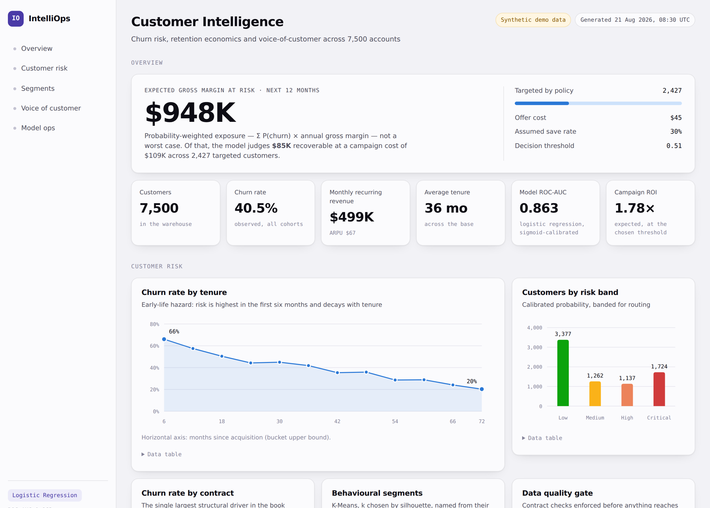

# IntelliOps AI Platform

**Enterprise customer intelligence: an ETL pipeline, a calibrated churn model with SHAP explanations, an NLP + RAG analyst, and a serving layer — as one deployable system.**

[](https://github.com/Divyadhole/IntelliOps-AI-Platform/actions/workflows/ci.yml)


```bash
git clone https://github.com/Divyadhole/IntelliOps-AI-Platform.git
cd IntelliOps-AI-Platform
pip install -r requirements.txt
make all          # ETL → train → segment → NLP → RAG index   (~30 seconds)
make api          # http://localhost:8000/docs
make dashboard    # http://localhost:8501
```

No Kaggle account, no API key, no GPU. The repo ships a generator that produces
data with the same schema and the same defects as the real IBM Telco file, so
`make all` works on a clean machine; drop the real CSV into `data/raw/` and
ingestion prefers it automatically.



*The static build. `make report` regenerates it from the warehouse; `make dashboard`
serves the interactive Streamlit version of the same page.*

---

## The problem

A subscription business loses customers for reasons that live in different systems:
billing records say *who* is at risk, support tickets say *why*, and neither is
usable by the person who has to decide who to call on Monday morning. This platform
joins the two and outputs a ranked, costed call list plus a natural-language analyst
that can answer "why are customers leaving?" with numbers, causes and quotes.

---

## Architecture

```
                    ┌─────────────────────────────────────────────┐
  Structured        │  MODULE 1 — Data Engineering                │
  (billing,         │  ingest → validate (data contract)          │
   contracts,       │        → clean → engineer → warehouse       │
   demographics) ──▶│  32 quality checks · 12 derived features    │
                    └───────────────────┬─────────────────────────┘
                                        │
                        SQLite / Postgres warehouse
                    dim_customers · fct_customer_features
                    fct_reviews   · ops_data_quality
                                        │
              ┌─────────────────────────┼─────────────────────────┐
              ▼                         ▼                         ▼
  ┌───────────────────────┐ ┌──────────────────────┐ ┌───────────────────────┐
  │ MODULE 2 — Prediction │ │ MODULE 3 — Language  │ │ MODULE 2b — Segments  │
  │ LR · RF · XGB · LGBM  │ │ clean → sentiment    │ │ K-Means, k by         │
  │ 5-fold CV selection   │ │ → NMF topics         │ │ silhouette, auto-named│
  │ Platt calibration     │ │ → hybrid vector index│ │                       │
  │ SHAP explanations     │ │ → RAG analyst        │ │                       │
  │ expected-value policy │ │   (grounded, cited)  │ │                       │
  └───────────┬───────────┘ └──────────┬───────────┘ └───────────┬───────────┘
              │                        │                         │
              └────────────────────────┼─────────────────────────┘
                                       ▼
                    ┌─────────────────────────────────────────────┐
                    │  MODULE 4 — Serving                         │
                    │  FastAPI  /predict_churn /explain /ask      │
                    │  Streamlit executive dashboard              │
                    │  MLflow · Docker · GitHub Actions           │
                    └─────────────────────────────────────────────┘
```

---

## What each module does, and the decision behind it

### Module 1 — Data engineering (`src/intelliops/data_pipeline/`)

Ingest → **validate against a data contract** → clean → engineer → load.

The validation layer is the part most portfolio pipelines skip. Before anything
reaches the warehouse, 32 checks run: schema presence, per-column null budgets,
duplicate budgets, numeric range assertions and a target base-rate sanity check.
Blocking failures raise; soft failures warn. **Every result is persisted to
`ops_data_quality`** rather than printed, so quality is a time series, not a
one-off console message.

Cleaning handles the defects the real dataset actually has — `TotalCharges`
arrives as a string with blanks for tenure-0 customers, and the file contains
exact duplicate rows. The blank is reconstructed as `tenure × MonthlyCharges`
rather than median-imputed, because a customer who has billed nothing has
genuinely billed nothing.

Twelve engineered features, all business-legible: `charge_drift` (is this
customer paying more than their own historical average — a proxy for a recent
price rise), `services_count`, `tenure_bucket`, `avg_charge_per_month`,
`annual_margin_at_risk`, and review-derived aggregates.

### Module 2 — Churn prediction (`src/intelliops/churn_model/`)

Four candidates — logistic regression, random forest, XGBoost, LightGBM — under
5-fold stratified cross-validation. On the shipped data:

| Model | CV ROC-AUC | Test ROC-AUC | PR-AUC | Brier |
|---|---|---|---|---|
| **Logistic regression** ✅ | **0.856 ± 0.006** | **0.863** | 0.819 | 0.154 |
| XGBoost | 0.851 ± 0.006 | 0.854 | 0.813 | 0.152 |
| Random forest | 0.849 ± 0.007 | 0.854 | 0.809 | 0.154 |
| LightGBM | 0.841 ± 0.006 | 0.836 | 0.791 | 0.163 |

After Platt calibration: **ROC-AUC 0.863, Brier 0.147, top-decile lift 2.34×**
(the top 10% of scored customers contains 23% of all churners).

**The baseline won, and the baseline shipped.** Gradient boosting is within noise
of a regularised logistic regression here because the engineered features already
capture the non-linearities. That is a real and common result; selecting the
complex model anyway would cost interpretability and latency for nothing. The
full comparison is logged to MLflow so the claim is auditable.

**Calibration is sigmoid, not isotonic.** Isotonic scored marginally better on
Brier (0.1466 vs 0.1468) but is non-parametric and saturates — it returns exactly
`0.0` and `1.0` at the tails. Since every dollar figure downstream multiplies by
that probability, saturation propagates false certainty into the business case.
Platt stays strictly inside (0, 1).

**The decision threshold is chosen by expected value, not by 0.5 or by F1:**

```
EV(offer) = P(churn) × P(save | offer) × margin_at_risk − offer_cost
```

Only customers with **positive EV** are contacted. A customer who is 95% likely
to leave but pays $20/month is not worth a $45 retention offer — a pure
probability threshold misses that, and it is exactly the mistake that makes a
retention campaign lose money. On the test set: threshold 0.51, 593 of 1,500
customers targeted, **expected net saving $17,113 on a $26,685 campaign — 1.64× ROI**.

SHAP attributions are rendered as sentences with actions attached, because a
beeswarm plot is not an explanation to a retention manager:

```json
{
  "churn_probability": 0.976, "risk_band": "Critical",
  "expected_value_of_offer": 76.14,
  "recommended_action": "Priority save call + retention offer",
  "top_drivers": [
    {"reason": "short tenure with the company", "direction": "increases risk",
     "recommended_action": "Enrol in the first-year onboarding programme"},
    {"reason": "month-to-month contract", "direction": "increases risk",
     "recommended_action": "Offer a discounted 12-month contract"}
  ]
}
```

### Module 3 — NLP and the RAG analyst (`nlp_engine/`, `rag_assistant/`)

Text normalisation (PII-ish tokens masked) → sentiment → TF-IDF → NMF topics →
per-topic aggregation of volume, sentiment, rating and customer reach.

The retrieval index deliberately contains **both verbatim customer text and
rendered facts from the structured layer** — KPIs, contract-level churn rates,
the model's global SHAP drivers, topic aggregates. That is what lets one question
be answered with a number, a cause and a quote at the same time.

Three retrieval decisions worth their space:

1. **Hybrid search.** Dense cosine similarity fused with lexical TF-IDF. Pure
   dense retrieval loses exact matches on product names and identifiers.
2. **Stratified evidence budget.** A flat top-k over 3,000 reviews and 8 topic
   rows returns six near-duplicate reviews. Quotas per source guarantee the
   answer sees the KPI *and* the drivers *and* the themes *and* the quotes.
3. **Query expansion.** "Why are customers *leaving*?" scores ≈0 against a corpus
   that says "churn", "cancel", "switched". A domain synonym map bridges the gap.

Every claim carries an `[E3]`-style citation resolvable to a warehouse row or a
customer message, and the system prompt forbids any number not present in the
evidence. **With no API key configured the endpoint still answers** — a
deterministic synthesiser assembles the same answer shape from the retrieved
structured evidence, so the demo never degrades into an apology.

### Module 4 — Serving (`api/`, `dashboard/`)

FastAPI with `/predict_churn`, `/predict_churn/batch`, `/ask`, `/kpis`,
`/customers/high-risk`, `/health`, `/metrics`, and OpenAPI docs at `/docs`.

- Model and vector index load **once at startup**, not per request.
- The service starts **degraded rather than crash-looping** when the model is
  missing, and `/health` says which component failed and how to fix it.
- Every response carries `x-request-id` and `x-process-time-ms`; `/metrics`
  exposes request counts, error counts and p50/p95 latency.
- **The serving path re-applies training-time feature engineering.** The API
  accepts raw customer attributes but the model was trained on engineered
  features; without this the request silently scores against the average customer
  on precisely the fields carrying the most signal. This is the train/serve skew
  that makes production models quietly worse than their offline metrics, and the
  fix is a shared transform — `prepare_for_inference()` — used on both sides.

### The dashboard, in two forms

**`make dashboard`** serves the interactive Streamlit app: one scrolling executive
page with the campaign economics live in the sidebar. Move the save rate or the
offer cost and the call list, the campaign ROI and the exposure figure all
re-price in front of you — the point being that the business case rests on three
assumptions nobody has measured yet, and the reader should be able to feel how
sensitive it is to them. Live single-customer scoring and the RAG analyst call the
API; everything else reads the warehouse, so the page still works with the API
stopped.

**`make report`** builds `artifacts/reports/dashboard.html` — the same page as one
self-contained file with no Python, no server and no CDN. It is what you send
someone.

Both render the **same chart primitives** (`intelliops/reporting/svg.py`) under the
same CSS custom properties, so the app and the shareable snapshot cannot drift
apart — and the platform needs no plotting library at all.

Details that matter more than they look:

- **The palette is validated, not chosen by eye.** Categorical hues clear a
  colour-vision-deficiency separation floor on both light and dark surfaces; the
  one hue that falls below 3:1 contrast appears only where direct labels carry the
  value anyway.
- **Risk bands use status colours, never a series colour**, and always ship with a
  label — colour never carries meaning alone.
- **Every chart has a data table** underneath it, so nothing is gated behind
  seeing colour.
- **Dark mode is designed, not inverted** — its own steps from the same ramps,
  validated against the dark surface.
- The call list is **ranked by expected value, not by risk**, which is the whole
  argument of the platform expressed as a sort order.

---

## MLOps

| Concern | Implementation |
|---|---|
| Experiment tracking | MLflow — params, metrics, calibration, decision policy per run |
| Configuration | One `configs/config.yaml`; env vars override for deployment |
| Containerisation | Multi-stage Dockerfiles, non-root user, healthchecks |
| Orchestration | `docker compose up` → Postgres + MLflow + bootstrap job + API + dashboard |
| Scheduling | Airflow DAG that imports the same functions the CLI calls |
| CI | Lint + tests on Python 3.10/3.11/3.12, full end-to-end run, image build |
| Quality gate | CI **fails the build if ROC-AUC drops below 0.78** |
| Tests | 92 tests: data contract, feature definitions, policy economics, retrieval, API contract, chart specs |

```bash
docker compose up -d      # full stack: Postgres, MLflow, API, dashboard
make test                 # 92 tests
make mlflow               # experiment UI at :5000
```

---

## Repository layout

```
IntelliOps-AI-Platform/
├── configs/config.yaml            # single source of truth for every module
├── src/intelliops/
│   ├── config.py  logging_utils.py
│   ├── data_pipeline/             # Module 1 — ETL + data contract + warehouse
│   │   ├── synthetic.py ingest.py validate.py transform.py
│   │   ├── warehouse.py run_pipeline.py airflow_dag.py
│   ├── churn_model/               # Module 2 — modelling + explainability
│   │   ├── features.py train.py evaluate.py explain.py predict.py segmentation.py
│   ├── nlp_engine/                # Module 3a — sentiment + topics
│   │   ├── clean.py sentiment.py topics.py run_nlp.py
│   ├── rag_assistant/             # Module 3b — retrieval + grounded generation
│   │   ├── vector_store.py retriever.py llm.py assistant.py
│   ├── api/                       # Module 4 — FastAPI serving
│   │   ├── main.py schemas.py
│   └── reporting/                 # Module 4 — static dashboard renderer
│       ├── svg.py build_dashboard.py
├── dashboard/app.py               # Streamlit executive dashboard
├── docs/                          # README screenshots
├── tests/                         # 69 tests
├── docker/  docker-compose.yml  .github/workflows/ci.yml  Makefile
```

---

## Using the real datasets

| Dataset | Where it goes | What it powers |
|---|---|---|
| [IBM Telco Customer Churn](https://www.kaggle.com/datasets/blastchar/telco-customer-churn) | `data/raw/telco_customer_churn.csv` | Churn model, segmentation |
| [Olist Brazilian E-Commerce](https://www.kaggle.com/datasets/olistbr/brazilian-ecommerce) | `data/raw/` (see `ingest.py`) | Transactions, CLV, forecasting |
| [Amazon Customer Reviews](https://www.kaggle.com/datasets/bittlingmayer/amazonreviews) | `data/raw/customer_reviews.csv` | Sentiment, topics, RAG corpus |

Ingestion checks for the real files first and falls back to the generator, so
adding real data is a file copy, not a code change.

---

## Honest limitations

Stating these is part of the engineering, not a disclaimer.

- **The shipped data is synthetic.** Metrics above describe a known generating
  process, so they are a demonstration that the pipeline works end to end — not
  evidence about real customers. Real Telco data typically lands at ROC-AUC
  0.84–0.86, which is why the CI gate sits at 0.78.
- **Review-derived features are a lagging indicator.** `avg_rating` ranks third
  in importance, but a complaint filed *after* a customer decided to leave is
  leakage in disguise. In production these features must be windowed to the
  period before the prediction date.
- **Topic labels are extractive.** Derived from NMF top terms, so they read like
  keyword clusters, not human topic names. An LLM labelling pass would fix this.
- **Association, not causation.** The retention actions attached to SHAP drivers
  are hypotheses to A/B test. The platform is designed to make the test easy —
  it is not evidence that the test would succeed.
- **The offer economics are assumptions.** Save rate, offer cost and margin
  multiplier live in `configs/config.yaml` and should be replaced with the
  organisation's measured values; every dollar figure is only as good as those
  three numbers.

---

## Resume summary

**Enterprise AI Intelligence Platform** — *Python, SQL, XGBoost, LightGBM, SHAP, Transformers, RAG, FastAPI, MLflow, Docker, GitHub Actions*

- Built an end-to-end customer intelligence platform integrating structured billing data with unstructured feedback through a validated ETL pipeline enforcing 32 automated data-quality checks and 12 engineered features.
- Developed and cross-validated four churn models (logistic regression, random forest, XGBoost, LightGBM), selecting and calibrating the winner at **0.863 ROC-AUC / 0.147 Brier with 2.34× top-decile lift**, with SHAP explanations rendered as actionable retention reasons.
- Designed an **expected-value targeting policy** that converts calibrated probabilities and campaign economics into a ranked call list, yielding a modelled **1.64× campaign ROI** versus untargeted outreach.
- Built an NLP and RAG layer — sentiment, NMF topic discovery, hybrid dense+lexical retrieval over structured facts and verbatims — answering executive questions with cited, grounded evidence and a deterministic fallback when no LLM is configured.
- Shipped the platform as a FastAPI service and Streamlit dashboard with MLflow tracking, multi-stage Docker images, an Airflow DAG, and a GitHub Actions pipeline running 92 tests plus a model-quality gate.

---

## License

MIT
